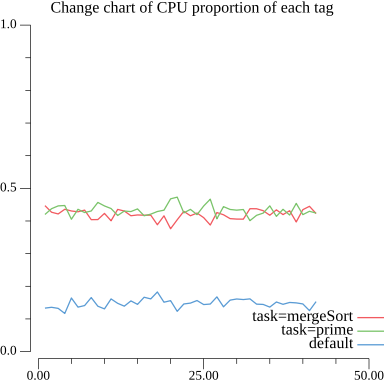
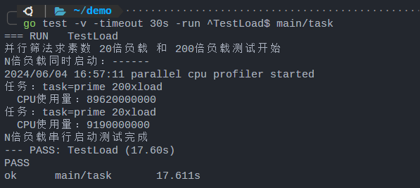

# demo功能/内容说明

说明：demo的功能基本上都在申请书中写明，此处写每个文件的内容概括，方便理解

- demo/task 文件夹存放的是任务本身和CPU数据处理函数
  - prime.go 是并行筛法求素数
  - mergeSort.go 是并行归并排序
  - profile.go 主要是注册消费者（提供数据处理函数）
  - graph.go 主要是用plot库对多次采集的CPU数据进行可视化分析（申请书中有图）
- demo/cpu_profile 文件夹是profile库的实现
  - api.go是库向外部暴露的接口
  - profile.go是CPU数据采集者的结构定义和接口定义实现
  - consume.go是消费者的接口定义和接口定义实现
  - collect.go是使用消费者来实现对`runtime/pprof`库的`StartCPUProfile`和`StopCPUProfile`两个接口的替代
  - web.go是对`net/http/pprof`的兼容处理

我已经将demo打包成linux(./demo/demo)和windows(./demo/demo.ext)的可执行文件，可以不用下载库依赖，可以通过配置命令行来配置参数（也设置了默认的参数），运行可执行文件之后，可以通过访问`localhost:8080/debug/pprof`来查看整个程序的web profile, 也可以通过访问 `localhost:8090/`来监控程序中两个任务的CPU占用量的对比

# 任务的说明

## 正常功能的测试

demo中使用了两个测试任务
- 并行筛法求素数：每次求解 2~10000 之间的素数
- 并行归并排序：每次对 500000 长度的数组排序

两个任务都会启动大量协程（符合eKuiper中一条规则启动大量协程的特点），在main.go中：

```go
for i := 0; i < 10000; i++ {
  wg.Add(2)
  go task.PrintPrime(ctx, "prime", enableProfile, &wg)
  go task.TaskMergeSort(ctx, "mergeSort", enableProfile, &wg)
  time.Sleep(100 * time.Millisecond)
}
```

在同一时间，一个任务类别会用多个任务在运行。

两个任务的CPU占用量数据统计函数会得到每个标签的CPU占用百分比并打印到日志中，我通过 go 中的 plot 库对所有标签的数据进行了可视化，可以在网页中实时监控每个任务的性能变化和两个任务之间的性能对比，如下图。




其中横坐标是任务启动采集 CPU 性能数据的次数，纵坐标是每个任务的CPU占用比例，一共有三个标签：
- task=prime：并行筛法求素数任务的协程的 CPU 占用量
- task=mergeSort：并行归并排序任务的协程的 CPU 占用量
- default: 没有打上任何标签的协程的占用量

可以从图中看到，运行过程中，两个任务的CPU占用量不相上下。


## 对于单个任务的负载测试

测试说明：以并行筛法求解 2~10000 素数为例，N 倍负载代表同时启动 N 个这样的任务（这 N 个任务将被打上同一个标签），在测试中，将同时启动 20 倍负载和 200 倍负载，并分别统计总 CPU 用量，测试结果如下：



可以看到：200 倍负载的 CPU 占用量几乎是 20 倍负载的 CPU 占用量的 10倍，符合预期